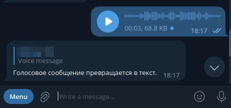
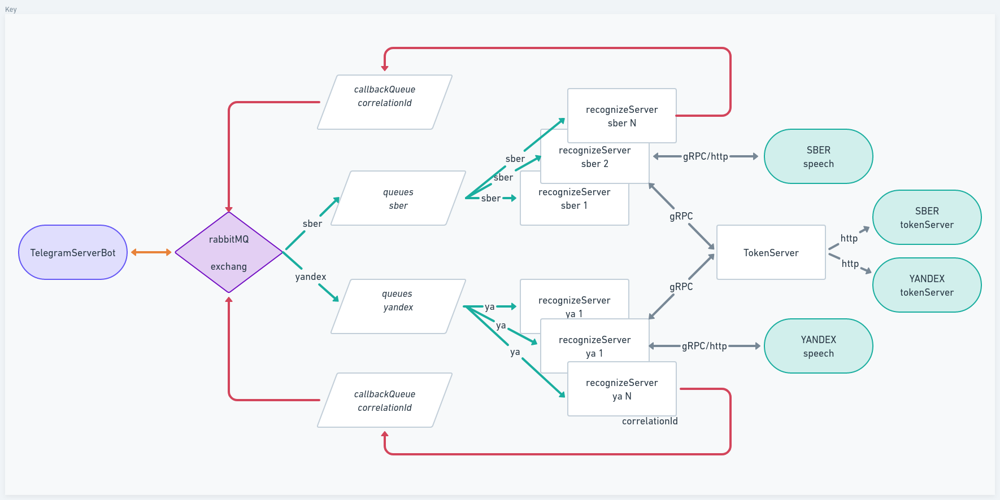

# Voice to Text Telegram Bot
## Описание
Производит траскрипцию голосовых сообщений в текст в групповых или персональных чатах

При поступлении `Voice` ообщения, `TelegramBot` ответом на сообщение отправляет текстовую транскрипцию:



## Схема работы


## Как запустить
1. клонировать репозиторий
2. сконфигурировать `TokenServer` и `TelegramBotServer`
```yaml
services:
  securing:
    environment:
      - CLIENT_ID_SBER_Access_Token=
      - CLIENT_Secret_SBER_Access_Token=
      - YA_FOLDER_ID=
      - YA_OAuth=
      - JWT_SIGNING_KEY=
...
...
bot:
  environment:
    - botToken=
```
### для этого необходимо
> получить `CLIENT_ID` и `CLIENT_Secret` на сайте [SBER](https://developers.sber.ru/docs/ru/salutespeech/authentication) \
> получить `IAM-token` и `folder-ID` на сайте [YANDEX](https://cloud.yandex.ru/docs/resource-manager/quickstart) \
> получить `token` Telegram бота на отца ботов `@BotFather` \
> задать `JWT_SIGNING_KEY` для подписи сообщей при обмене по `gPRC` между `TelegramBotServer` и `RecognizeServer`

3. собрать проект
```sh
./gradlew clean build
```
4. запустить в `docker`
```sh
docker compose up -d
```


